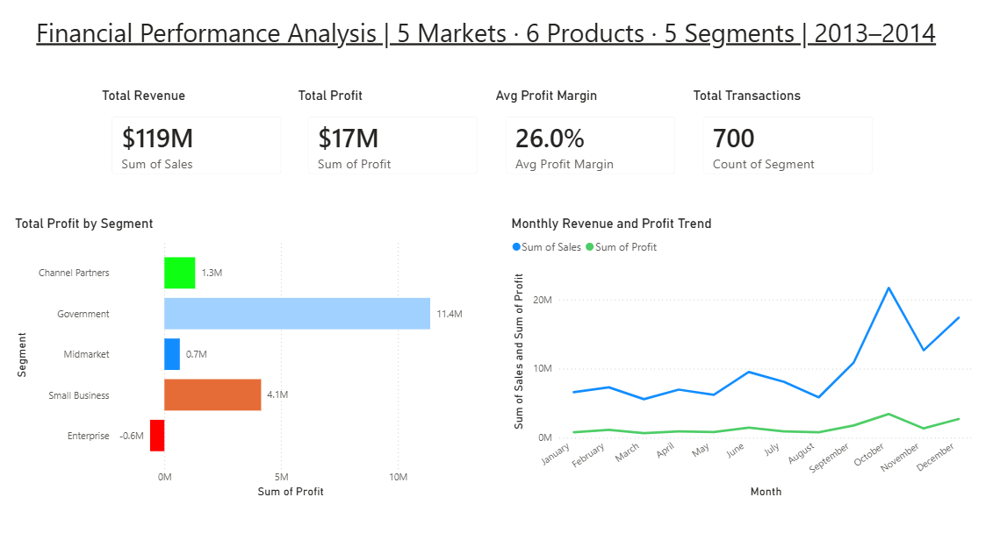
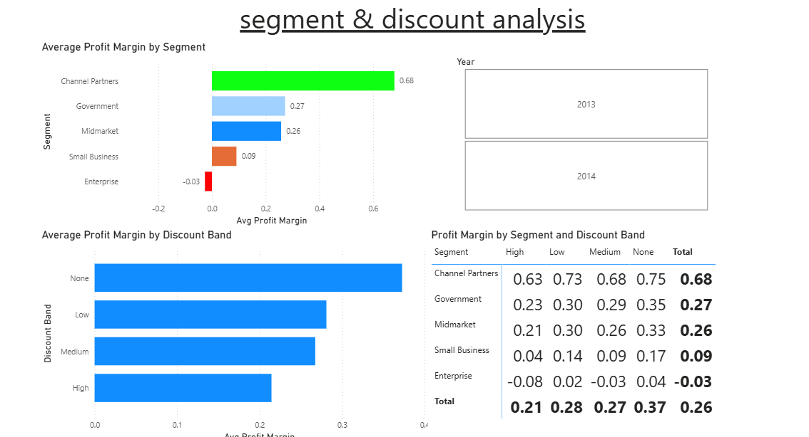
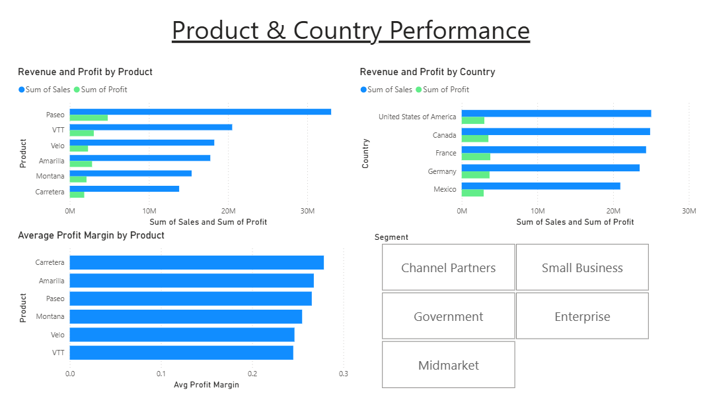

# financial-performance-analysis
Financial performance analysis using Excel, Python, SQL and Power BI. Identifies profitability drivers across segments, products and countries. Key finding: Enterprise segment is loss making at -2.6% while Channel Partners deliver 68% margins.

# Financial Performance Analysis

> Analysing financial performance across 5 markets, 6 products and 5 customer 
> segments to identify profitability drivers — revealing that Enterprise is 
> loss making at -2.6% margin while Channel Partners deliver 68% margins.

## Dashboard Preview

### Executive Summary

### Segment & Discount Analysis

### Product & Country Performance

### Enterprise Segment — Loss Making

## Business Problem
A business operating across 5 countries needed to understand which customer 
segments, products and markets were driving profitability — and where margins 
were being eroded. The analysis aimed to identify the biggest commercial risks 
and opportunities across the portfolio.

## Tools Used
- **Excel** — calculated columns, pivot tables, SUMIF, COUNTIF, nested IF formulas
- **Python** (Pandas, Matplotlib, Seaborn) — data cleaning, EDA and visualisation
- **SQL** (SQLite) — CTEs, JOINs and aggregations for segment validation
- **Power BI** — interactive three page dashboard

## Dataset
Financial Sample Dataset via Kaggle — 700 transactions across 2013-2014.
[Dataset Link](https://www.kaggle.com/datasets/nikahnos/financial-sample)

## Approach
1. Built calculated columns in Excel — Profit Margin %, Discount Impact %, 
   COGS % and Profit Category using nested IF formulas
2. Created pivot tables in Excel to analyse segment, country and product performance
3. Cleaned and analysed data in Python — converting percentage columns, 
   handling null discount bands and building visualisations
4. Validated findings in SQL using CTEs and JOINs across three queries
5. Built a three page interactive Power BI dashboard

## Key Findings
- **Enterprise is loss making at -2.6% average margin** — losing money on 
  every transaction across every product and country
- **Channel Partners deliver 68% margin** — the most profitable segment 
  by a significant margin
- **High discount transactions deliver 21% margin vs 37% for no discount** — 
  a 16 point gap confirming discounting is eroding profitability
- **Geography and product are not drivers of margin variance** — all five 
  countries and six products deliver consistent 25-28% margins
- **October is the peak month both years** — consistent seasonality 
  the business should plan around
- **Enterprise receives discounts despite already negative margins** — 
  compounding the profitability problem

## Recommendations
1. **Immediately review Enterprise pricing** — the segment is loss making 
   across all products, countries and discount bands
2. **Remove discounting from Enterprise transactions** — any discount 
   in this segment directly destroys value
3. **Protect and grow Channel Partners** — the highest margin segment 
   should be prioritised for growth investment
4. **Reduce High discount transactions** — replacing High with Low discount 
   adds approximately 7 margin points per transaction
5. **Investigate Small Business margins** — consistently thin at 9% 
   with no clear path to improvement without pricing review

## Files
- `financial-performance.ipynb` — Python analysis notebook
- `financial_performance_analysis.pbix` — Power BI dashboard
- `excel/financial_performance_analysis.xlsx` — Excel workbook with pivot tables
- `sql/sql_queries.sql` — Three SQL queries using CTEs and JOINs
- `data/financial_cleaned.csv` — Cleaned dataset

## Kaggle Notebook
[View full analysis on Kaggle](https://www.kaggle.com/code/matthewtwigge/financial-performance)
